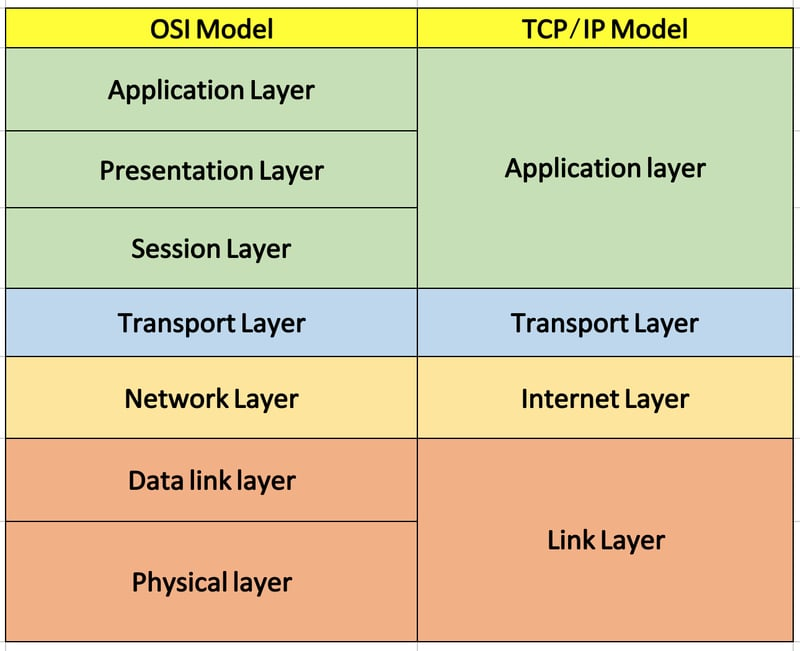

## Tìm hiểu về Networking
### Mô hình OSI && TCP/IP

OSI - Open Systems Interconnection (OSI): Mô hình kết nối các hệ thống mở là một khung khái niệm chia các chức năng truyền thông mạng thành 7 lớp.

TCP/IP - Transmission Control Protocol/Internet Protocol: Giao thức điều khiển truyền nhận/ Giao thức liên mạng. Đây là bộ các giao thức truyền thông được dùng để kết nối các thiết bị mạng trên internet với nhau.

Mô tả các tầng OSI và TCP/IP

#### Mô hình OSI 

Tóm tắt ngắn gọn mô hình OSI gồm 7 tầng:

+ Tầng Application: Cung cấp giao diện cho ứng dụng người dùng, thực hiện các dịch vụ như truyền tập tin, gửi email, và duyệt web.
+ Tầng Presentation: Đảm bảo dữ liệu được trình bày, định dạng, và mã hóa sao cho ứng dụng có thể hiểu được. Mã hóa, nén, và định dạng dữ liệu để truyền dẫn và hiển thị dữ liệu tương thích với ứng dụng người dùng.
+ Tầng Session: Quản lý kết nối phiên giữa các thiết bị, đồng bộ hóa việc truyền dữ liệu và quản lý phiên làm việc. Quản lý và duy trì kết nối phiên, bao gồm mở, đóng và duy trì phiên làm việc giữa các ứng dụng.
+ Tầng Transport: Đảm bảo dữ liệu được chuyển đến đúng đích, kiểm soát lỗi và đánh dấu các gói tin. Phân biệt dịch vụ truyền dữ liệu đáng tin cậy (TCP) và không đáng tin cậy (UDP), kiểm soát luồng dữ liệu và đảm bảo tính toàn vẹn của dữ liệu.
+ Tầng Network: Quản lý địa chỉ IP, định tuyến dữ liệu giữa các mạng. Định tuyến gói tin từ nguồn đến đích, kiểm soát luồng dữ liệu và quản lý giao diện mạng.
+ Tầng Data link: Quản lý truy cập vào phương tiện truyền dẫn và kiểm soát lỗi truyền dẫn. Đóng gói dữ liệu thành các khung (frame), kiểm tra lỗi và điều khiển truy cập trong mạng đa truy cập.
+ Tầng Physical: Định nghĩa các chuẩn về vật lý và điều khiển tín hiệu trên phương tiện truyền dẫn. Truyền dữ liệu thông qua phương tiện vật lý như cáp đồng, sợi quang, hoặc sóng vô tuyến.

 #### Mô hình TCP/IP

 Tóm tắt ngắn gọn mô hình TCP/IP gồm 4 tầng:
 
+ Tầng Application: Cung cấp cho các ứng dụng những trao đổi dữ liệu chuẩn hóa, giao tiếp dữ liệu giữa 2 máy khác nhau thông qua các dịch vụ mạng khác nhau
+ Tầng Transport: Đảm bảo duy trì thông tin liên lạc từ đầu đến cuối trên toàn mạng là trách nhiệm của TCP. Giao thức này xử lý việc liên lạc giữa các máy chủ và cung cấp các tính năng kiểm soát luồng, ghép kênh và đảm bảo độ tin cậy
+ Tầng Internet: Nhiệm vụ xử lý các gói tin mạng và kết nối các mạng độc lập, giúp vận chuyển các gói tin qua mạng
+ Tầng Physical: Bao gồm các giao thức hoạt động trên một liên kết duy nhất – thành phần mạng kết nối các nút hoặc máy chủ trong mạng, chịu trách nhiệm truyền dữ liệu giữa hai thiết bị trong cùng một mạng

 #### So sánh mô hình OSI và TCP/IP

 Giống:
 + Đều là mô hình logic để chuẩn hóa truyền thông mạng
 + Xác định tiêu chuẩn cho các mạng máy tính
 + Chia quá trình giao tiếp mạng thành nhiều tầng (layer) riêng biệt
 + Cung cấp khuôn khổ để tạo và triển khai các tiêu chuẩn và thiết bị mạng
 
| Khác | TCP/IP | OSI |
| --- |--- | --- |  
| Số lớp | 4 lớp | 7 lớp 
| Phổ biến | Nhiều sử dụng | Ít được sử dụng 
| Phương pháp tiếp cận | Chiều ngang | Chiều dọc
| Cách giao tiếp các tầng | Kết hợp để thực hiện nhiệm vụ | Mỗi tầng 1 nhiệm vụ riêng biệt
| Sự phụ thuộc | Phụ thuộc giao vào giao thức | Độc lập hoàn toàn
| Sự phát triển | Phát triển giao thức trước - xây dựng mô hình sau | Xây dựng mô hình trước - giao thức dựng sau

