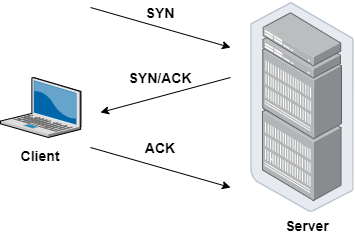
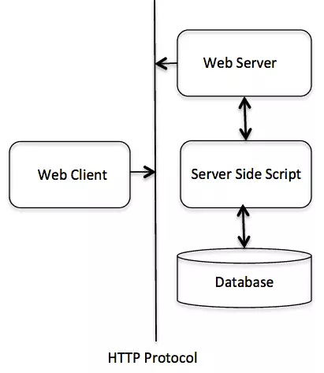

## Tìm hiểu về Networking
### I. Mô hình OSI && TCP/IP

Mô tả các tầng OSI và TCP/IP

#### 1. Mô hình OSI 

OSI - Open Systems Interconnection (OSI): Mô hình kết nối các hệ thống mở là một khung khái niệm chia các chức năng truyền thông mạng thành 7 lớp.

##### Tóm tắt ngắn gọn mô hình OSI gồm 7 tầng:

+ Tầng Application: Cung cấp giao diện cho ứng dụng người dùng, thực hiện các dịch vụ như truyền tập tin, gửi email, và duyệt web.
+ Tầng Presentation: Đảm bảo dữ liệu được trình bày, định dạng, và mã hóa sao cho ứng dụng có thể hiểu được. Mã hóa, nén, và định dạng dữ liệu để truyền dẫn và hiển thị dữ liệu tương thích với ứng dụng người dùng.
+ Tầng Session: Quản lý kết nối phiên giữa các thiết bị, đồng bộ hóa việc truyền dữ liệu và quản lý phiên làm việc. Quản lý và duy trì kết nối phiên, bao gồm mở, đóng và duy trì phiên làm việc giữa các ứng dụng.
+ Tầng Transport: Đảm bảo dữ liệu được chuyển đến đúng đích, kiểm soát lỗi và đánh dấu các gói tin. Phân biệt dịch vụ truyền dữ liệu đáng tin cậy (TCP) và không đáng tin cậy (UDP), kiểm soát luồng dữ liệu và đảm bảo tính toàn vẹn của dữ liệu.
+ Tầng Network: Quản lý địa chỉ IP, định tuyến dữ liệu giữa các mạng. Định tuyến gói tin từ nguồn đến đích, kiểm soát luồng dữ liệu và quản lý giao diện mạng.
+ Tầng Data link: Quản lý truy cập vào phương tiện truyền dẫn và kiểm soát lỗi truyền dẫn. Đóng gói dữ liệu thành các khung (frame), kiểm tra lỗi và điều khiển truy cập trong mạng đa truy cập.
+ Tầng Physical: Định nghĩa các chuẩn về vật lý và điều khiển tín hiệu trên phương tiện truyền dẫn. Truyền dữ liệu thông qua phương tiện vật lý như cáp đồng, sợi quang, hoặc sóng vô tuyến.

 #### 2. Mô hình TCP/IP

TCP/IP - Transmission Control Protocol/Internet Protocol: Giao thức điều khiển truyền nhận/ Giao thức liên mạng. Đây là bộ các giao thức truyền thông được dùng để kết nối các thiết bị mạng trên internet với nhau.

Hoạt động TCP:
TCP hoạt động theo tiến trình bắt tay 3 bước (3 way handshake). Tiến trình này hoạt động như sau:

+ Máy khách gửi cho máy chủ một gói SYN — một yêu cầu kết nối từ port nguồn của nó đến port đích đến của máy chủ
+ Máy chủ phản hồi bằng gói SYN/ACK, xác nhận việc nhận được yêu cầu kết nối
+ Máy khách nhận gói SYN/ACK và trả lời bằng gói ACK của chính nó

Sau khi kết nối được thiết lập, TCP hoạt động bằng cách chia nhỏ dữ liệu đã truyền thành các segment (phân đoạn), mỗi segment được đóng gói thành một gói dữ liệu và được gửi đến đích của nó.
#### Tóm tắt ngắn gọn mô hình TCP/IP gồm 4 tầng:

+ Tầng Application: Cung cấp cho các ứng dụng những trao đổi dữ liệu chuẩn hóa, giao tiếp dữ liệu giữa 2 máy khác nhau thông qua các dịch vụ mạng khác nhau
+ Tầng Transport: Đảm bảo duy trì thông tin liên lạc từ đầu đến cuối trên toàn mạng là trách nhiệm của TCP. Giao thức này xử lý việc liên lạc giữa các máy chủ và cung cấp các tính năng kiểm soát luồng, ghép kênh và đảm bảo độ tin cậy
+ Tầng Internet: Nhiệm vụ xử lý các gói tin mạng và kết nối các mạng độc lập, giúp vận chuyển các gói tin qua mạng
+ Tầng Physical: Bao gồm các giao thức hoạt động trên một liên kết duy nhất – thành phần mạng kết nối các nút hoặc máy chủ trong mạng, chịu trách nhiệm truyền dữ liệu giữa hai thiết bị trong cùng một mạng

 #### 3. So sánh mô hình OSI và TCP/IP

 Giống:
 + Đều là mô hình logic để chuẩn hóa truyền thông mạng
 + Xác định tiêu chuẩn cho các mạng máy tính
 + Chia quá trình giao tiếp mạng thành nhiều tầng (layer) riêng biệt
 + Cung cấp khuôn khổ để tạo và triển khai các tiêu chuẩn và thiết bị mạng
 
 Khác:

| Phân loại | TCP/IP | OSI |
| --- |--- | --- |  
| Số lớp | 4 lớp | 7 lớp 
| Phổ biến | Nhiều sử dụng | Ít được sử dụng 
| Phương pháp tiếp cận | Chiều ngang | Chiều dọc
| Cách giao tiếp các tầng | Kết hợp để thực hiện nhiệm vụ | Mỗi tầng 1 nhiệm vụ riêng biệt
| Sự phụ thuộc | Phụ thuộc giao vào giao thức | Độc lập hoàn toàn
| Sự phát triển | Phát triển giao thức trước - xây dựng mô hình sau | Xây dựng mô hình trước - giao thức dựng sau

 #### 4. Giao thức HTTP 

 Giao thức HTTP (Hypertext Transfer Protocol) được sử dụng rộng rãi trong việc truyền tải dữ liệu qua World Wide Web. HTTP cho phép trình duyệt của người dùng gửi yêu cầu đến máy chủ để truy cập nội dung trang web, từ đó tải về và hiển thị thông tin. 

#### Cấu trúc hoạt động:

Giao thức HTTP còn được biết đến là một giao thức theo kiểu Yêu cầu – Phản hồi dựa trên cấu trúc Client – Server. Theo đó, Client và Server sẽ có xu hướng giao tiếp với nhau bằng cách trao đổi các message độc lập (điều này trái ngược hoàn toàn với một luồng dữ liệu). Các message này sẽ được gửi bởi Client, thông thường là qua một trình duyệt web. Các yêu cầu cũng như message sau đó sẽ được gửi lại bởi server như một sự trả lời, hay còn được gọi là phản hồi.

#### Phương thức HTTP (HTTP Methods)

HTTP hỗ trợ nhiều phương thức yêu cầu khác nhau, mỗi phương thức có mục đích riêng trong việc xử lý tài nguyên trên máy chủ:
+ GET: Yêu cầu truy xuất tài nguyên từ máy chủ (ví dụ: tải một trang web)
+ POST: Gửi dữ liệu đến máy chủ để tạo mới hoặc cập nhật tài nguyên
+ PUT: Tương tự POST, nhưng thường dùng để cập nhật toàn bộ tài nguyên
+ DELETE: Xóa tài nguyên trên máy chủ
+ HEAD: Tương tự GET nhưng không trả về phần nội dung chính của tài nguyên, chỉ trả về các tiêu đề
+ PATCH: Cập nhật một phần tài nguyên (khác với PUT cập nhật toàn bộ)
+ OPTIONS: Lấy thông tin về các phương thức HTTP mà máy chủ hỗ trợ cho tài nguyên cụ thể

#### Phương thức kết nối của HTTP

HTTP là một giao thức mạnh mẽ nhờ vào khả năng xử lý linh hoạt các yêu cầu và phản hồi giữa máy khách và máy chủ. Quá trình này gồm các bước như sau:

#### 4.1 Yêu cầu (Request)
Khi máy khách (client) gửi yêu cầu đến máy chủ (server) qua HTTP, yêu cầu này bao gồm:
+ Phương thức yêu cầu: Các phương thức như GET (yêu cầu thông tin), POST (gửi dữ liệu), PUT (cập nhật dữ liệu), DELETE (xóa tài nguyên).
+ URL tài nguyên: Địa chỉ của tài nguyên trên máy chủ.
+ Dữ liệu biểu mẫu: Dữ liệu kèm theo trong các yêu cầu POST, PUT.
+ Tiêu đề yêu cầu: Thông tin bổ sung như ngôn ngữ, định dạng dữ liệu mong muốn.

#### 4.2 Xử lý yêu cầu (Request Processing)
Sau khi nhận được yêu cầu từ client, máy chủ xử lý nó bằng cách:
+ Kiểm tra tính hợp lệ: Xem xét cú pháp và quyền truy cập.
+ Truy xuất dữ liệu: Truy cập cơ sở dữ liệu hoặc các nguồn khác nếu cần.
+ Thực hiện logic ứng dụng: Máy chủ xử lý các thao tác yêu cầu như truy vấn, đăng nhập, hoặc lưu trữ thông tin.

#### 4.3 Phản hồi (Response)
Sau khi xử lý, máy chủ gửi phản hồi lại client. Phản hồi này bao gồm:
+ Mã trạng thái: Thông báo kết quả của yêu cầu như 200 (OK), 404 (Not Found), 500 (Internal Server Error).
+ Dữ liệu phản hồi: Nội dung trang web hoặc thông tin liên quan mà client yêu cầu.

#### 4.4 Xử lý phản hồi (Response Processing)
Client nhận phản hồi từ máy chủ và xử lý nó bằng cách:
+ Kiểm tra phản hồi: Xem xét mã trạng thái để xác định kết quả yêu cầu.
+ Hiển thị nội dung: Nếu thành công, nội dung sẽ được hiển thị qua trình duyệt.
+ Sử dụng dữ liệu: Client có thể dùng dữ liệu cho các mục đích khác, như cập nhật giao diện hoặc lưu trữ thông tin.
