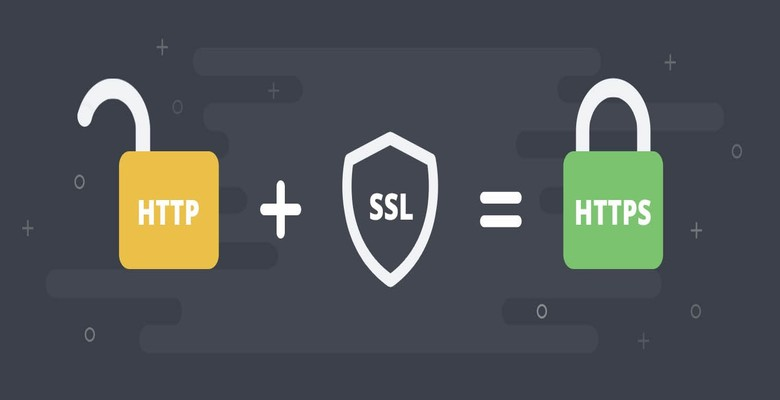
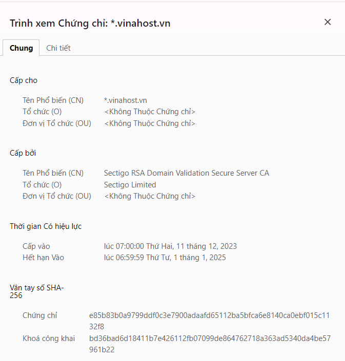
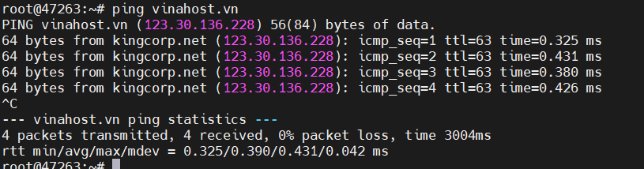
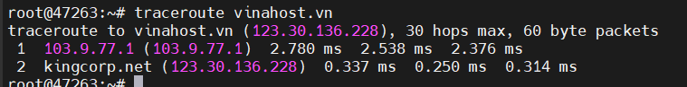
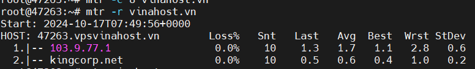
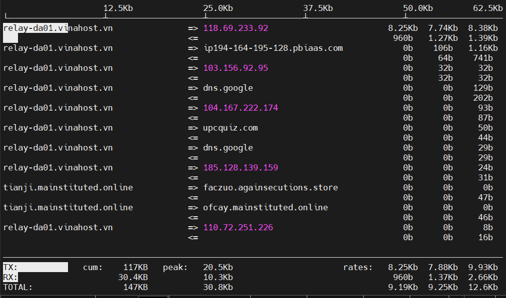
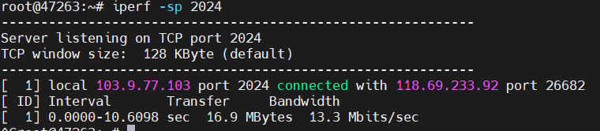

## Tìm hiểu về Networking
### I. Mô hình OSI, Giao thức TCP, HTTP, SSL

Mô tả các tầng OSI và TCP/IP

#### 1. Mô hình OSI 

OSI - Open Systems Interconnection (OSI): Mô hình kết nối các hệ thống mở là một khung khái niệm chia các chức năng truyền thông mạng thành 7 lớp.

##### Tóm tắt ngắn gọn mô hình OSI gồm 7 tầng:

+ Tầng Application: Cung cấp giao diện cho ứng dụng người dùng, thực hiện các dịch vụ như truyền tập tin, gửi email, và duyệt web.
+ Tầng Presentation: Đảm bảo dữ liệu được trình bày, định dạng, và mã hóa sao cho ứng dụng có thể hiểu được. Mã hóa, nén, và định dạng dữ liệu để truyền dẫn và hiển thị dữ liệu tương thích với ứng dụng người dùng.
+ Tầng Session: Quản lý kết nối phiên giữa các thiết bị, đồng bộ hóa việc truyền dữ liệu và quản lý phiên làm việc. Quản lý và duy trì kết nối phiên, bao gồm mở, đóng và duy trì phiên làm việc giữa các ứng dụng.
+ Tầng Transport: Đảm bảo dữ liệu được chuyển đến đúng đích, kiểm soát lỗi và đánh dấu các gói tin. Phân biệt dịch vụ truyền dữ liệu đáng tin cậy (TCP) và không đáng tin cậy (UDP), kiểm soát luồng dữ liệu và đảm bảo tính toàn vẹn của dữ liệu.
+ Tầng Network: Quản lý địa chỉ IP, định tuyến dữ liệu giữa các mạng. Định tuyến gói tin từ nguồn đến đích, kiểm soát luồng dữ liệu và quản lý giao diện mạng.
+ Tầng Data link: Quản lý truy cập vào phương tiện truyền dẫn và kiểm soát lỗi truyền dẫn. Đóng gói dữ liệu thành các khung (frame), kiểm tra lỗi và điều khiển truy cập trong mạng đa truy cập.
+ Tầng Physical: Định nghĩa các chuẩn về vật lý và điều khiển tín hiệu trên phương tiện truyền dẫn. Truyền dữ liệu thông qua phương tiện vật lý như cáp đồng, sợi quang, hoặc sóng vô tuyến.

 #### 2. Mô hình TCP/IP

TCP/IP - Transmission Control Protocol/Internet Protocol: Giao thức điều khiển truyền nhận/ Giao thức liên mạng. Đây là bộ các giao thức truyền thông được dùng để kết nối các thiết bị mạng trên internet với nhau.

Hoạt động TCP:
TCP hoạt động theo tiến trình bắt tay 3 bước (3 way handshake). Tiến trình này hoạt động như sau:

+ Máy khách gửi cho máy chủ một gói SYN — một yêu cầu kết nối từ port nguồn của nó đến port đích đến của máy chủ
+ Máy chủ phản hồi bằng gói SYN/ACK, xác nhận việc nhận được yêu cầu kết nối
+ Máy khách nhận gói SYN/ACK và trả lời bằng gói ACK của chính nó

Sau khi kết nối được thiết lập, TCP hoạt động bằng cách chia nhỏ dữ liệu đã truyền thành các segment (phân đoạn), mỗi segment được đóng gói thành một gói dữ liệu và được gửi đến đích của nó.
#### Tóm tắt ngắn gọn mô hình TCP/IP gồm 4 tầng:

+ Tầng Application: Cung cấp cho các ứng dụng những trao đổi dữ liệu chuẩn hóa, giao tiếp dữ liệu giữa 2 máy khác nhau thông qua các dịch vụ mạng khác nhau
+ Tầng Transport: Đảm bảo duy trì thông tin liên lạc từ đầu đến cuối trên toàn mạng là trách nhiệm của TCP. Giao thức này xử lý việc liên lạc giữa các máy chủ và cung cấp các tính năng kiểm soát luồng, ghép kênh và đảm bảo độ tin cậy
+ Tầng Internet: Nhiệm vụ xử lý các gói tin mạng và kết nối các mạng độc lập, giúp vận chuyển các gói tin qua mạng
+ Tầng Physical: Bao gồm các giao thức hoạt động trên một liên kết duy nhất – thành phần mạng kết nối các nút hoặc máy chủ trong mạng, chịu trách nhiệm truyền dữ liệu giữa hai thiết bị trong cùng một mạng

 #### So sánh mô hình OSI và TCP/IP

 Giống:
 + Đều là mô hình logic để chuẩn hóa truyền thông mạng
 + Xác định tiêu chuẩn cho các mạng máy tính
 + Chia quá trình giao tiếp mạng thành nhiều tầng (layer) riêng biệt
 + Cung cấp khuôn khổ để tạo và triển khai các tiêu chuẩn và thiết bị mạng
 
 Khác:

| Phân loại | TCP/IP | OSI |
| --- |--- | --- |  
| Số lớp | 4 lớp | 7 lớp 
| Phổ biến | Nhiều sử dụng | Ít được sử dụng 
| Phương pháp tiếp cận | Chiều ngang | Chiều dọc
| Cách giao tiếp các tầng | Kết hợp để thực hiện nhiệm vụ | Mỗi tầng 1 nhiệm vụ riêng biệt
| Sự phụ thuộc | Phụ thuộc giao vào giao thức | Độc lập hoàn toàn
| Sự phát triển | Phát triển giao thức trước - xây dựng mô hình sau | Xây dựng mô hình trước - giao thức dựng sau

 #### 3. Giao thức HTTP 

 Giao thức HTTP (Hypertext Transfer Protocol) được sử dụng rộng rãi trong việc truyền tải dữ liệu qua World Wide Web. HTTP cho phép trình duyệt của người dùng gửi yêu cầu đến máy chủ để truy cập nội dung trang web, từ đó tải về và hiển thị thông tin. 

#### Cấu trúc hoạt động:

Giao thức HTTP còn được biết đến là một giao thức theo kiểu Yêu cầu – Phản hồi dựa trên cấu trúc Client – Server. Theo đó, Client và Server sẽ có xu hướng giao tiếp với nhau bằng cách trao đổi các message độc lập (điều này trái ngược hoàn toàn với một luồng dữ liệu). Các message này sẽ được gửi bởi Client, thông thường là qua một trình duyệt web. Các yêu cầu cũng như message sau đó sẽ được gửi lại bởi server như một sự trả lời, hay còn được gọi là phản hồi.

#### Phương thức HTTP (HTTP Methods)

HTTP hỗ trợ nhiều phương thức yêu cầu khác nhau, mỗi phương thức có mục đích riêng trong việc xử lý tài nguyên trên máy chủ:
+ GET: Yêu cầu truy xuất tài nguyên từ máy chủ (ví dụ: tải một trang web)
+ POST: Gửi dữ liệu đến máy chủ để tạo mới hoặc cập nhật tài nguyên
+ PUT: Tương tự POST, nhưng thường dùng để cập nhật toàn bộ tài nguyên
+ DELETE: Xóa tài nguyên trên máy chủ
+ HEAD: Tương tự GET nhưng không trả về phần nội dung chính của tài nguyên, chỉ trả về các tiêu đề
+ PATCH: Cập nhật một phần tài nguyên (khác với PUT cập nhật toàn bộ)
+ OPTIONS: Lấy thông tin về các phương thức HTTP mà máy chủ hỗ trợ cho tài nguyên cụ thể

#### Phương thức kết nối của HTTP

HTTP là một giao thức mạnh mẽ nhờ vào khả năng xử lý linh hoạt các yêu cầu và phản hồi giữa máy khách và máy chủ. Quá trình này gồm các bước như sau:

#### 3.1 Yêu cầu (Request)
Khi máy khách (client) gửi yêu cầu đến máy chủ (server) qua HTTP, yêu cầu này bao gồm:
+ Phương thức yêu cầu: Các phương thức như GET (yêu cầu thông tin), POST (gửi dữ liệu), PUT (cập nhật dữ liệu), DELETE (xóa tài nguyên).
+ URL tài nguyên: Địa chỉ của tài nguyên trên máy chủ.
+ Dữ liệu biểu mẫu: Dữ liệu kèm theo trong các yêu cầu POST, PUT.
+ Tiêu đề yêu cầu: Thông tin bổ sung như ngôn ngữ, định dạng dữ liệu mong muốn.

#### 3.2 Xử lý yêu cầu (Request Processing)
Sau khi nhận được yêu cầu từ client, máy chủ xử lý nó bằng cách:
+ Kiểm tra tính hợp lệ: Xem xét cú pháp và quyền truy cập.
+ Truy xuất dữ liệu: Truy cập cơ sở dữ liệu hoặc các nguồn khác nếu cần.
+ Thực hiện logic ứng dụng: Máy chủ xử lý các thao tác yêu cầu như truy vấn, đăng nhập, hoặc lưu trữ thông tin.

#### 3.3 Phản hồi (Response)
Sau khi xử lý, máy chủ gửi phản hồi lại client. Phản hồi này bao gồm:
+ Mã trạng thái: Thông báo kết quả của yêu cầu như 200 (OK), 404 (Not Found), 500 (Internal Server Error).
+ Dữ liệu phản hồi: Nội dung trang web hoặc thông tin liên quan mà client yêu cầu.

#### 3.4 Xử lý phản hồi (Response Processing)
Client nhận phản hồi từ máy chủ và xử lý nó bằng cách:
+ Kiểm tra phản hồi: Xem xét mã trạng thái để xác định kết quả yêu cầu.
+ Hiển thị nội dung: Nếu thành công, nội dung sẽ được hiển thị qua trình duyệt.
+ Sử dụng dữ liệu: Client có thể dùng dữ liệu cho các mục đích khác, như cập nhật giao diện hoặc lưu trữ thông tin.

 #### 4. Giao thức SSL 
SSL được viết tắt từ Secure Sockets Layer, đây là một tiêu chuẩn của công nghệ bảo mật, truyền thông mã hóa giữa trình duyệt và máy chủ web server. SSL hoạt động và đảm bảo rằng những dữ liệu được truyền tải giữa máy chủ và trình duyệt của bạn đều được toàn vẹn, riêng tư và bảo mật. Hiện nay, SSL được xem là tiêu chuẩn bảo mật cho đa số website trên thế giới, giúp dữ liệu truyền đi trên Internet được bảo vệ một cách an toàn.

#### 4.1 Cách hoạt động SSL
HTTPS sử dụng giao thức SSL (Secure Sockets Layer) hoặc giao thức tiếp nối tầng bảo mật TLS để bảo mật thông tin liên lạc bằng cách truyền dữ liệu qua mạng Internet được mã hóa. SSL hoạt động dựa trên hai khái niệm chính: mã hóa bất đối xứng (asymmetric cryptography) và mã hóa đối xứng (symmetric cryptography).

Khi người dùng truy cập vào một dịch vụ hỗ trợ SSL, như một trang web, quá trình kết nối diễn ra như sau:

+ Ứng dụng của người dùng yêu cầu khóa công khai từ máy chủ để trao đổi với khóa công khai của chính nó.
+ Việc trao đổi khóa công khai này cho phép cả hai bên có thể mã hóa các tin nhắn mà chỉ bên đích mới có thể giải mã được.
+ Khi người dùng gửi tin nhắn đến máy chủ, ứng dụng sử dụng khóa công khai của máy chủ để mã hóa tin nhắn.
+ Máy chủ nhận tin nhắn từ người dùng và giải mã nó bằng khóa riêng của mình. Sau đó, tin nhắn được mã hóa và gửi trở lại trình duyệt của người dùng bằng cách sử dụng khóa công khai do ứng dụng của người dùng tạo ra.

Qua quá trình này, thông tin truyền tải giữa người dùng và máy chủ được bảo mật bằng cách sử dụng mã hóa và khóa công khai/ riêng tư để đảm bảo chỉ những người có khóa riêng mới có thể giải mã và đọc được tin nhắn.

#### 4.2 Các thành phần SSL

Các thành phần chung của chứng chỉ SSL như sau:
+ CSR (Certificate Signing Request): là một tài liệu văn bản chứa thông tin về chủ sở hữu tên miền đã được mã hóa. Thông tin này được gửi đến nhà cung cấp dịch vụ SSL để xác minh và xác nhận.

+ CRT (Certificate): Là thành phần được trả về sau khi CSR đã được xác nhận và chứa thông tin chứng chỉ SSL. Nếu CSR được tạo ra để nhà cung cấp SSL xác nhận tính tin cậy của website với thông tin đã được mã hóa trong nó, thì CRT là một tài liệu để trình duyệt web tin tưởng vào.

+ Private key: Là một file mã hóa được tạo ra cùng với CSR. Để giải thích một cách đơn giản, hãy tưởng tượng rằng CRT là một phần mã hóa công khai mà trình duyệt web sử dụng để truy cập vào website của bạn. Khi dữ liệu đến đến website, nó cần một chìa khóa riêng để mở khóa thông tin đã được mã hóa trong CRT.

+ CA (Certificate Authority hoặc Certification Authority): Là một tổ chức hoặc cơ quan cung cấp thông tin về chứng chỉ SSL.

#### 4.3 Vai trò SSl

+ Bảo mật thông tin bằng mã hóa

SSL giúp cho thông tin nhạy cảm trở nên an toàn khi chúng ta gửi qua Internet. SSL hoạt động bằng cách biến thông tin thành một loại “ngôn ngữ” chỉ có những người có chìa khóa mới có thể hiểu được. Khi bạn gửi thông tin trên Internet, thông tin đó di chuyển qua nhiều máy tính trước khi đến máy chủ đích. Nếu thông tin này không được bảo vệ bằng chứng chỉ SSL, bất kỳ máy tính nào ở giữa đường truyền đều có thể xem được. Điều này có nghĩa là thông tin như số thẻ tín dụng, tên đăng nhập và mật khẩu, cũng như các thông tin quan trọng khác có thể bị lộ ra ngoài. 

+ Cung cấp tính xác thực

Ngoài việc bảo mặt bằng cách biến thông tin thành ngôn ngữ bí mật, chứng nhận SSL còn đảm bảo rằng bạn đang gửi thông tin đến máy chủ đúng đích, chứ không phải tới một kẻ giả mạo đang cố gắng lừa đảo hoặc đánh cắp thông tin. Những nhà cung cấp SSL đáng tin cậy sẽ đặt điều kiện cho các công ty phải xác minh danh tính của họ trước khi nhận chứng chỉ SSL.

+ Tăng uy tín website

Khi bạn truy cập một trang web an toàn, trình duyệt web thường sẽ hiển thị cho bạn những biểu tượng khóa hoặc một thành màu xanh lá cây để cho biết kết nối đang được bảo mật. Những dấu hiệu này giúp người dùng cảm thấy an tâm hơn và tin tưởng trang web.

+ Tăng độ tin tưởng của người truy cập

HTTPS cũng giúp ngăn chặn các cuộc tấn công lừa đảo và các email gửi từ tội phạm giả mạo trang web của bạn. Trong các email này, thường sẽ có một liên kết dẫn bạn đến trang web của tội phạm hoặc họ có thể sử dụng chiêu thức “Man-in-the-middle” (tên tội phạm sẽ lừa người dùng gửi thông tin nhạy cảm trực tiếp cho họ) trên tên miền của trang web giả mạo. 

+ Bảo mật thanh toán (PCI Compliance)

Để cho phép người dùng nhập thông tin thẻ tín dụng trên trang web, bạn phải qua một loạt các kiểm tra để chứng minh rằng bạn tuân thủ các tiêu chuẩn an toàn khi thanh toán bằng thẻ, gọi là Payment Card Industry (PCI). Để đủ tiêu chuẩn, đương nhiên bạn cần sử dụng chứng chỉ SSL. Khi đó, các thông tin thẻ tín dụng của người dùng sẽ được bảo mật và an toàn khi họ thực hiện giao dịch trực tuyến.

+ Tối ưu SEO

Google đã thông báo rằng việc sử dụng HTTPS sẽ ảnh hưởng đến việc xếp hạng trang web. Khi hiển thị kết quả tìm kiếm, các trang web có SSL sẽ được đặt ưu tiên hơn so với các trang web tương tự nhưng không có SSL. Điều này giúp cải thiện tính bảo mật và độ tin cậy của trang web, đồng thời tạo điều kiện tốt hơn cho người dùng khi tìm kiếm thông tin trực tuyến.

#### 4.4 Nhược điểm SSl

+ Tăng tải cho máy chủ: Mã hóa và giải mã dữ liệu trong quá trình truyền thông qua SSL có thể tốn thêm tài nguyên máy chủ, gây ra một chút tăng tải và làm chậm quá trình truyền dữ liệu.

+ Chi phí: Một số chứng chỉ SSL có giá cao, đặc biệt là các chứng chỉ mở rộng như EV SSL. Điều này có thể tạo ra một chi phí đáng kể đối với các tổ chức nhỏ hoặc cá nhân muốn bảo mật trang web của mình.

+ Đòi hỏi quá trình xác thực: Việc xác thực chứng chỉ SSL có thể đòi hỏi một số thủ tục phức tạp và mất thời gian, đặc biệt là đối với các loại chứng chỉ cao cấp như EV SSL.

+ Khả năng tấn công trung gian: Một số hình thức tấn công trung gian như tấn công Man-in-the-Middle (MITM) có thể xảy ra trong quá trình thiết lập kết nối SSL nếu không được triển khai đúng cách. Điều này có thể đe dọa tính bảo mật của dữ liệu truyền qua SSL.

+ Hạn chế của chứng chỉ tự ký: Chứng chỉ tự ký (self-signed) không được phê duyệt bởi một cơ quan xác thực đáng tin cậy, do đó, trình duyệt web sẽ cảnh báo người dùng về tính bảo mật không đáng tin cậy của chứng chỉ này.

### II. Các lớp IP không gian Private IP Address

#### 1. Các lớp IP

Bảng phân tích cấu tạo của địa chỉ IP

| Các lớp địa chỉ IP | Mô tả |
|---- | ---- | 
| `Lớp A` | Bao gồm các địa chỉ IP có giá trị oc-tet đầu tiên nằm trong khoảng từ 1 đến 126 và dải địa chỉ trải dài từ 128.1.0.0 đến 191.254.0.0. Phân bổ chủ yếu cho các tổ chức lớn trên toàn cầu. 
| `Lớp B` | Bao gồm các địa chỉ IP có giá trị oc-tet đầu tiên nằm trong khoảng từ 128 đến 191. và dải địa chỉ trải dài từ 128.1.0.0 đến 191.254.0.0. Phân bổ chủ yếu cho các tổ chức tầm trung trên toàn cầu.
| `Lớp C` | Bao gồm các địa chỉ IP có giá trị oc-tet đầu tiên nằm trong khoảng từ 192 đến 223 và dải địa chỉ trải dài từ 192.0.1.0 đến 223.255.254.0 Phân bổ chủ yếu cho các tổ chức nhỏ trên toàn cầu. 
| `Lóp D` | Bao gồm các địa chỉ IP có giá trị oc-tet đầu tiên trong khoảng từ 224 đến 239, với 4 bit đầu tiên cố định là 1110 và dải địa chỉ trải dài từ 224.0.0.0 đến 239.255.255.255. Dành riêng cho multicast hoặc broadcast.
| `Lớp E` |  Bao gồm các địa chỉ IP có giá trị oc-tet đầu tiên nằm trong khoảng từ 240 đến 255 và sải địa chỉ trải dài từ 240.0.0.0 đến 254.255.255.255. Chỉ dành cho việc nghiên cứu.

Trong thực tế, các địa chỉ IP lớp A B C được sử dụng phổ biến để thiết lập cho các thiết bị trong mạng. Địa chỉ lớp D thường dành riêng cho các ứng dụng truyền thông đa phương tiện. Còn địa chỉ lớp E vẫn đang được thử nghiệm và dự trữ cho các mục đích phát triển trong tương lai.

Ngoài ra, còn có một lớp đặc biệt gọi là Loopback, được đại diện bởi địa chỉ 127.x.x.x. Lớp này được sử dụng để kiểm tra vòng lặp quy hồi (loopback) và chỉ được sử dụng trong nội bộ của thiết bị.

#### 1.2 Các phiên bản IP
Địa chỉ IP bao gồm 2 phiên bản là IPv4 và IPv6:

+ IPv4 (Internet Protocol version 4) là một phiên bản của giao thức Internet Protocol (IP), được thiết kế để xác định và gửi dữ liệu giữa các thiết bị trên Internet. IPv4 là phiên bản chính thức đầu tiên của IP và là nền tảng cơ bản cho việc kết nối mạng trên toàn cầu.

+ IPv6 (Internet Protocol version 6) là một phiên bản của giao thức Internet Protocol (IP), được thiết kế để thay thế và mở rộng IPv4 (Internet Protocol version 4), phiên bản IP trước đó. IPv6 được phát triển để giải quyết vấn đề cạn kiệt địa chỉ IP duy nhất của IPv4 do sự mở rộng nhanh chóng của Internet và sự gia tăng số lượng thiết bị kết nối.

#### 1.3 Phân loại IP

Bảng phân loại IP

| Phân loại IP | Mô tả |
| ---------- | --------- | 
| `IP Public` | IP public, còn được gọi là IP công cộng, là địa chỉ mạng được cung cấp bởi nhà cung cấp dịch vụ internet. Đây là địa chỉ mà các mạng gia đình hoặc doanh nghiệp sử dụng để kết nối với các thiết bị khác trên internet. IP public cho phép các thiết bị trong mạng truy cập vào web và giao tiếp trực tiếp với các máy tính khác.
| `IP PRIVATE` | IP private, hay còn được gọi là IP riêng, được sử dụng trong mạng LAN nội bộ. Khác với public IP, private IP không thể kết nối với mạng Internet. Chỉ có các thiết bị máy tính, máy in,… trong mạng cục bộ mới có thể giao tiếp với nhau thông qua router. IP private có thể được cấp tự động bởi bộ định tuyến hoặc được thiết lập thủ công
| `IP Static` | IP static (hay địa chỉ IP tĩnh), là cách đặt IP thủ công cho từng thiết bị một và không thay đổi theo thời gian. Điều này đảm bảo rằng địa chỉ IP của thiết bị sẽ không thay đổi và luôn được nhận dạng cố định trên mạng.
| `IP Dynamic ` | IP dynamic (hay địa chỉ IP động) là IP có thể thay đổi từ một địa chỉ này sang địa chỉ khác. Quá trình thay đổi này hoàn toàn tự động và được quản lý bởi máy chủ DHCP (Dynamic Host Configuration Protocol). Điều này cho phép tối ưu việc quản lý và phân phối IP trong mạng.

### III. Ý nghĩa của các công cụ 

#### 1. Ping 
Công cụ kiểm tra kết nối mạng giữa hai thiết bị, dựa trên giao thức ICMP. Nó gửi gói tin ICMP Echo Request và nhận phản hồi ICMP Echo Reply. Kiểm tra xem một thiết bị từ xa có sẵn và có thể truy cập qua mạng hay không, và đo độ trễ (latency).

Trong đó:
+ `PING vinahost.vn (123.30.136.228) 56(84) bytes of data` Dòng này cho biết bạn đang ping đến vinahost.vn, có địa chỉ IP là 123.30.136.228. Thông tin 56(84) bytes cho biết kích thước của gói tin được gửi đi (56 byte) và kích thước của toàn bộ dữ liệu được gửi đi (bao gồm cả header, 84 byte)
+ `64 bytes from kingcorp.net (123.30.136.228) icmp_seq=1 ttl=63 time=0.325 ms` Dòng này hiển thị kết quả của gói tin đầu tiên được gửi đi.
  + 64 bytes from kingcorp.net: Cho biết gói tin đã được nhận lại, có kích thước 64 byte và đến từ kingcorp.net
`Lưu ý` rằng kingcorp.net có thể là tên miền của máy chủ VinaHost mà bạn đang ping, hoặc là một máy chủ trung gian trên đường đi
  + icmp_seq=1: Số thứ tự của gói tin (gói tin đầu tiên)
  + ttl=128: Thời gian sống (Time To Live) của gói tin còn lại 128 lần nhảy (hop) giữa các router trước khi bị loại bỏ
  + time=6.26 ms: Thời gian tính bằng mili giây để gói tin đi và về (round-trip time - RTT). Các dòng tiếp theo giải thích tương tự 
+ `--- vinahost.vn ping statistics ---`  Dòng này bắt đầu phần tóm tắt thống kê của quá trình ping.
+ `4 packets transmitted, 4 received, 0% packet loss, time 3004ms -` 
  + 4 packets transmitted: Tổng số gói tin được gửi đi là 4
  + 4 received: Tổng số gói tin nhận được phản hồi là 8 (tất cả các gói đều được nhận lại)
  + 0% packet loss: Tỷ lệ mất gói tin là 0%, nghĩa là không có gói tin nào bị mất trên đường đi
  + time3004ms: Tổng thời gian thực hiện lệnh ping là 7837 mili giây (khoảng 3.04 giây)
+ `rtt min/avg/max/mdev = 0.325/0.390/0.431/0.042 ms`
  + rtt: Thời gian phản hồi (round-trip time)
  + min: Thời gian phản hồi thấp nhất là 0.325 mili giây    
  + avg: Thời gian phản hồi trung bình là 0.390 mili giây
  + max: Thời gian phản hồi cao nhất là 0.431 mili giây
  + mdev: Độ lệch chuẩn của thời gian phản hồi là 0.042 mili giây

#### 2. Telnet 
Công cụ dùng để kiểm tra kết nối TCP đến một máy chủ cụ thể trên một cổng nào đó. Được sử dụng để kết nối tới các dịch vụ dựa trên TCP, chẳng hạn như HTTP, FTP, SMTP, hoặc kiểm tra xem một cổng có mở hay không.

Cú pháp: `telnet <dia_chi_ip>  23`

#### 3. Traceroute
Công cụ cho phép theo dõi hành trình của một gói tin từ thiết bị nguồn đến đích qua mạng, và xem các router trung gian mà gói tin đã đi qua. Chẩn đoán sự cố kết nối, phát hiện điểm tắc nghẽn hoặc các router bị hỏng trên đường đi.

Cú pháp:
+ Trên `Windows`: tracert vinahost.vn 
+ Trên `Kali`: traceroute vinahost.vn

Trong đó: 

- `traceroute to vinahost.vn (123.30.136.228), 30 hops max, 60 byte packets`
  - traceroute to vinahost.vn: Đây là lệnh được sử dụng để theo dõi đường đi đến vinahost.vn
  - (123.30.136.228): Đây là địa chỉ IP của máy chủ VinaHost
  - 30 hops max: Đây là số lần nhảy tối đa mà gói tin có thể thực hiện trước khi bị loại bỏ
  - 60 byte packets: Kích thước của các gói tin được sử dụng trong quá trình traceroute là 60 byte
- `1  103.9.77.1 (103.9.77.1)  2.780 ms  2.538 ms  2.376 ms`
  - 1: Đây là lần nhảy đầu tiên. Gói tin đã đến một máy chủ có địa chỉ IP 103.9.77.1
  - 103.9.77.1 (103.9.77.1): Tên miền (nếu có) và địa chỉ IP của máy chủ
  - 2.780 ms 2.538 ms 2.376 ms: Thời gian (tính bằng mili giây) cần thiết để gói tin đến đích ở lần nhảy này. Ba số đại diện cho ba lần gửi thử của gói tin, cho thấy độ trễ dao động nhẹ
- `2  kingcorp.net (123.30.136.228)  0.337 ms  0.250 ms  0.314 ms`
  - 2: Đây là lần nhảy thứ hai ( đích đến). Gói tin đã đến máy chủ đích kingcorp.net, có địa chỉ IP 123.30.136.228. Đây cũng là địa chỉ IP của VinaHost mà bạn đang ping
  - kingcorp.net (123.30.136.228): Tên miền và địa chỉ IP của máy chủ đích
  - 0.337 ms 0.250 ms 0.314 ms: Thời gian phản hồi của gói tin ở lần nhảy này rất thấp, chỉ nằm trong khoảng từ 0.250 ms đến 0.337 ms. Điều này cho thấy kết nối đến máy chủ VinaHost là rất nhanh.

#### 4. mtr 
Một công cụ kết hợp cả ping và traceroute, hiển thị theo thời gian thực hành trình của các gói tin qua mạng và tính toán thông số hiệu suất như độ trễ, mất gói. Giám sát và phân tích hiệu suất mạng theo thời gian thực

Trong đó:
- `Start: 2024-10-17T07:49:56+0000`: Thời điểm bắt đầu thực hiện lệnh mtr.
HOST: 47263.vpsvinahost.vn: Tên máy chủ của bạn (có thể là tên miền hoặc địa chỉ IP).

Các cột trong bảng:

- `HOST`: Địa chỉ IP của mỗi lần nhảy (hop) trên đường đi đến đích.
- `Loss%`: Tỷ lệ phần trăm gói tin bị mất tại mỗi lần nhảy. Trong trường hợp này, tất cả các gói tin đều đến đích (0% mất mát).
- `Snt`: Tổng số gói tin được gửi đến mỗi lần nhảy (thường là 10).
- `Last`: Thời gian phản hồi (RTT) của gói tin cuối cùng được gửi đến mỗi lần nhảy (tính bằng mili giây).
- `Avg`: Thời gian phản hồi trung bình của tất cả các gói tin được gửi đến mỗi lần nhảy.
- `Best`: Thời gian phản hồi nhanh nhất của một gói tin đến mỗi lần nhảy.
- `Wrst`: Thời gian phản hồi chậm nhất của một gói tin đến mỗi lần nhảy.
- `StDev`: Độ lệch chuẩn của thời gian phản hồi, cho biết mức độ dao động của các lần đo.

#### 5. iftop
Công cụ giám sát lưu lượng mạng theo thời gian thực, hiển thị băng thông sử dụng của từng kết nối mạng. Giám sát lưu lượng mạng, giúp phát hiện các nguồn sử dụng nhiều băng thông hoặc các vấn đề mạng. Iftop sẽ hiển thị danh sách các tiến trình sử dụng băng thông mạng được cập nhật theo thời gian thực trung bình cứ sau 2, 10 và 40 giây.

#### 6. iperf 
Công cụ đo băng thông mạng giữa hai thiết bị, sử dụng TCP hoặc UDP. Đo tốc độ truyền dữ liệu và hiệu suất của kết nối mạng.

Cú pháp:

Trên server: `iperf -sp 2024` 
- s: thiết lập server 
- p: lắng nghe cổng kết nối là 2024

Trên client: `iperf -c 103.9.77.103 -p 2024` 
- c: chế độ client
- 103.9.77.103: Ip server 
- p: cổng 2024

Trong đó:
- `Server listening on TCP port 2024`: Máy chủ đang lắng nghe trên cổng TCP 2024, chờ nhận kết nối từ máy khách.
- `TCP window size: 128 KByte (default)`: Kích thước cửa sổ TCP mặc định là 128 KB.
- `[ 1] local 103.9.77.103 port 2024 connected with 118.69.233.92 port 26682:`
  - `[ 1]`: Đây là luồng kết nối đầu tiên (có thể có nhiều luồng nếu nhiều máy khách kết nối cùng lúc).
  - `local 103.9.77.103 port 2024`: Địa chỉ IP và cổng của máy chủ.
  - `connected with 118.69.233.92 port 26682:` Địa chỉ IP và cổng của máy khách đã kết nối.
- `[ ID] Interval Transfer Bandwidth`: Các cột này hiển thị thông tin về kết nối:
  - `ID`: Số thứ tự của luồng kết nối
  - `Interval`: Khoảng thời gian của cuộc kiểm tra (từ đầu đến cuối)
  - `Transfer`: Tổng lượng dữ liệu đã truyền trong khoảng thời gian đó
  - `Bandwidth`: Băng thông trung bình trong khoảng thời gian đó

Kết quả:
- Cuộc kiểm tra diễn ra trong khoảng thời gian 10.6098 giây. Tổng lượng dữ liệu truyền là 16.9 MB. Băng thông trung bình là 13.3 Mbits/sec.

